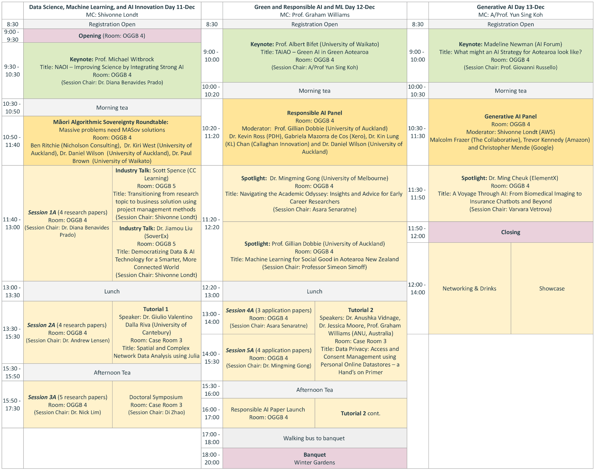
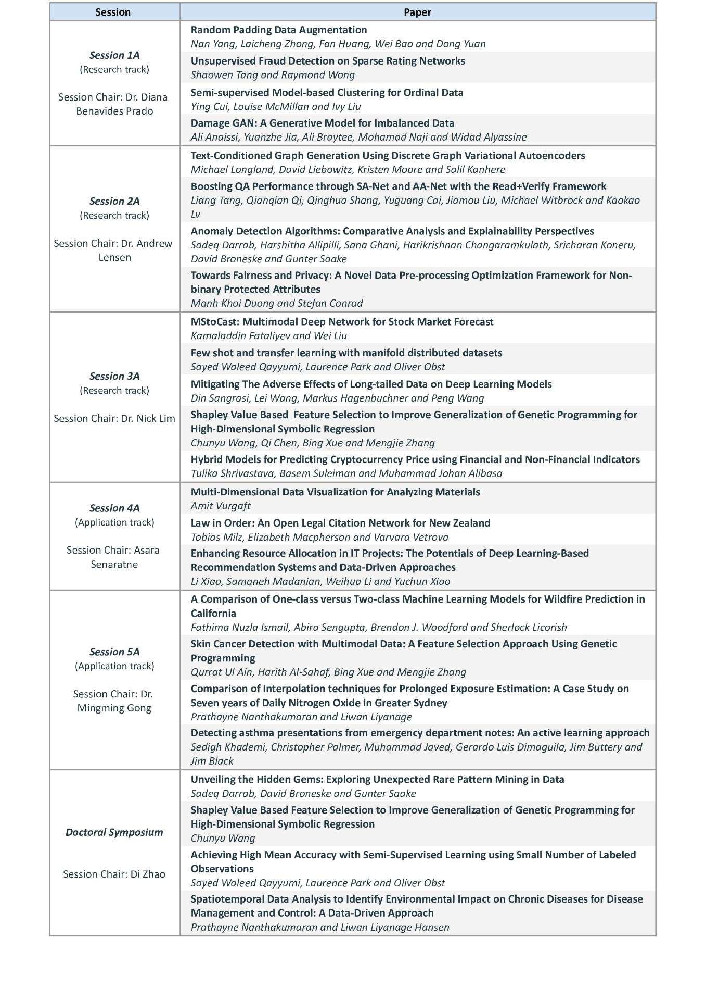

# Conference Programme

*All times are given in NZDT (UTC+13, New Zealand Daylight time).

Please refer to the AusDM 2023 program booklet for all session and event details.

---

# Session Details

**Speaker instructions (research and application tracks):**
 
The AusDM research and application tracks program consists of oral presentations.

Each paper is allocated **15 minutes** of talk time + 5 minutes of Q&A. It is important to present a high-level perspective of your contribution. 

Please check your assigned session and be mindful of day and time. The session chair will collect presentations before the start of the session. Therefore, it is required that you arrive to your session at least 10 minutes before the start of the session. Please bring your presentation slides in a USB. 
Oral presentations will be presented in **Room OGGB 4** for all sessions and the doctoral symposium.

