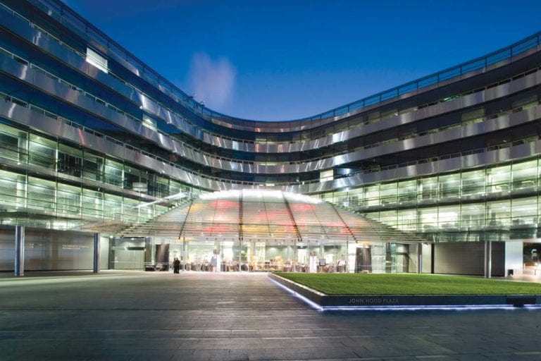

# Sir Owen G Glenn Building – University of Auckland

AusDM’23 will be held at the University of Auckland’s Sir Owen G Glenn Building at the heart of Auckland’s main commercial centre.

The Sir Owen G Glenn Building is a renowned and award-winning structure designed to cater to the needs of staff and students. It offers integrated facilities such as lecture theatres, computer labs, workrooms, and social spaces, all surrounding a stunning 26m-high atrium.

# Getting Here

Parking – The Owen G Glenn Building (OGGB) has five levels of car parking (over 1,000 spaces) and is the main car park on The University of Auckland City Campus. Access to the car park is via Grafton Road, opposite Stanley Street. More information can be found here.

Accessibility – The Owen G Glenn building (12 Grafton Rd) is mobility and wheelchair accessible and has accessible and unisex toilets. Mobility parking spaces (spaces that are larger and nearer to access ways) are available within the building car park. A CCS mobility car parking permit is required to park in these spaces.

Public Transport – Auckland Transport offers frequent bus services with several direct routes that arrive and depart from the university. For public transport timetables and further information, please visit https://at.govt.nz/.

